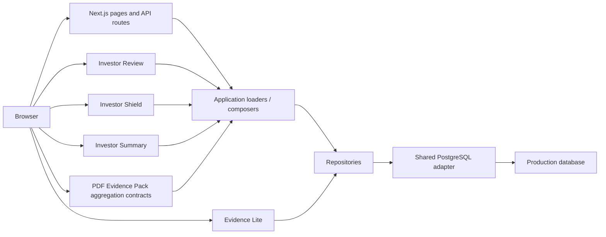

# Phase 4H-1A - Current Architecture Documentation Only

## Purpose

This documents the approved Phase 4 architecture for handover and recovery reference. It is descriptive only and does not propose a redesign.

## Technology Stack

- Next.js
- TypeScript
- PostgreSQL
- Vercel
- Vitest

## Architecture Diagram



## Application Layers

1. Presentation layer
   - React components and server-rendered pages render the user-facing review surfaces.
   - Representative files: `components/investor-review/InvestorReviewDocument.tsx`, `components/evidence-lite/EvidenceLitePanel.tsx`, `app/saved-deals/[id]/review/page.tsx`.
2. API/page boundary
   - Route handlers and server pages normalize ids, enforce safe response shapes, and dispatch to loaders.
   - Representative files: `app/api/saved-deals/[id]/investor-shield-ui/route.ts`, `app/api/saved-deals/[id]/evidence/route.ts`, `app/saved-deals/[id]/review/page.tsx`.
3. Application orchestration layer
   - Loaders compose canonical data from summary, Shield, Evidence Lite, tasks, and offers into read models.
   - Representative files: `lib/investor-review/load-investor-review-page-model.ts`, `lib/pdf-evidence-pack/load-pdf-evidence-pack.ts`, `lib/investor-summary/investor-summary-repository.ts`.
4. Deterministic engine and governance layer
   - Business evaluation remains deterministic for deal classification, capital protection, and Shield gating.
   - Representative files: `lib/investor-shield/load-investor-shield-ui-model.ts`, `lib/investor-shield/evaluate-investor-shield.ts`, `lib/engine/*`.
5. Repository layer
   - Data-access helpers load saved deals, Shield inputs, tasks, offers, and Evidence Lite records.
   - Representative files: `lib/operator-command/saved-deals-repository.ts`, `lib/evidence-lite/evidence-lite-repository.ts`, `lib/operator-command/deal-tasks-repository.ts`, `lib/operator-command/deal-offers-repository.ts`.
6. Shared database adapter
   - A single shared PostgreSQL pool is created through one adapter.
   - Representative file: `lib/db/postgres.ts`.
7. Database layer
   - The production database stores saved-deal and supporting record data accessed through the adapter.
   - Production access is routed through the configured environment-based connection.
8. Test and validation layer
   - Vitest and lint/build checks verify the architecture stays deterministic, read-safe, and regression-free.
   - Representative files: `__tests__/investor-review-page.test.tsx`, `__tests__/investor-shield-ui-route.test.ts`, `__tests__/evidence-lite-panel.test.tsx`, `__tests__/load-pdf-evidence-pack.test.ts`.

## Deterministic Authority Boundary

- formulas and financial calculations remain deterministic
- classifications remain deterministic
- capital-protection logic remains deterministic
- Investor Shield may block or increase caution
- Evidence Lite cannot satisfy or override Investor Shield
- the browser Investor Review does not recalculate business values

## Core Read Flows

### Investor Review

```text
saved-deal review page
→ canonical PDF Evidence Pack loader
→ Investor Summary
→ Investor Shield
→ Evidence Lite
→ tasks and offers
→ presentation mapper
→ read-only review document
```

### Evidence Lite

```text
API validation
→ normalized Evidence Lite input
→ Evidence Lite repository
→ database
→ read-only display
```

### Investor Shield

```text
saved deal
→ canonical Shield loading/evaluation
→ gate status and progression result
→ UI/view model
```

## Write Boundaries

Current write-capable areas remain limited to the route and repository surfaces that were intentionally built for controlled mutations in earlier phases. The browser Investor Review document itself has no mutation controls and is rendered as read-only.

- read-only surfaces:
  - Investor Review page
  - Investor Summary page/data render
  - Investor Shield UI read model
  - Evidence Lite display and refresh flow
- write-capable surfaces:
  - controlled Evidence Lite and saved-deal-related mutation routes that exist in the codebase from prior phases

This handover step does not claim the full application is read-only.

## Access-Control Boundary

The repository documents controlled read-only browser proof and safe route behavior, but it does not prove broad application authentication or authorization for all saved-deal routes.

Verified:

- safe 400 and 404 response shapes on selected read routes
- no secret leakage in the documented error envelopes
- read-only Investor Review and Evidence Lite rendering paths

Unresolved:

- full application access control
- broad permission model beyond the documented controlled review paths
- separate existing-deal / missing-Shield-record 404 proof under the current Shield model

## Deployment Boundary

The current deployment boundary is:

- Git repository as the source of truth
- Vercel-hosted Next.js production deployment
- configured production database connection through `DATABASE_URL`
- environment-variable-based configuration

The repository evidence shows Vercel production aliasing, safe route responses, and production database-backed reads without exposing secret values.

## Important Source Locations

- `app/saved-deals/[id]/review/page.tsx`
- `app/api/saved-deals/[id]/investor-shield-ui/route.ts`
- `app/api/saved-deals/[id]/evidence/route.ts`
- `components/investor-review/InvestorReviewDocument.tsx`
- `components/evidence-lite/EvidenceLitePanel.tsx`
- `lib/investor-review/load-investor-review-page-model.ts`
- `lib/pdf-evidence-pack/load-pdf-evidence-pack.ts`
- `lib/investor-summary/investor-summary-repository.ts`
- `lib/investor-shield/load-investor-shield-ui-model.ts`
- `lib/db/postgres.ts`
- `lib/operator-command/saved-deals-repository.ts`
- `docs/phase4/PHASE_4F_R3_CONTROLLED_PRODUCTION_BROWSER_PROOF.md`
- `docs/phase4/PHASE_4G_FINAL_PHASE_4_ACCEPTANCE_PACK.md`

## Architecture Constraints

- no duplicated deterministic engine
- no second Shield evaluator
- no second database pool
- no Evidence Lite authority escalation
- no PDF generation
- no AI/OCR
- no scraping
- no upload pipeline
- no CRM expansion
- no automation expansion

## Known Architecture Limitations

- access-control limitations remain documented rather than fully resolved
- PDF generation remains unimplemented
- the Investor Review mobile page is long and requires careful viewport validation
- missing-Shield-record 404 is not separately represented under the current model

## Explicit Non-Implementation

- no runtime code changed
- no database schema documented in this step
- no production access
- no deployment change
- no README change
- no release tag
- no Phase 5 work

## Result

`PHASE 4H-1A ARCHITECTURE DOCUMENTATION COMPLETE - READY FOR PHASE 4H-1B DATABASE SCHEMA DOCUMENTATION`

