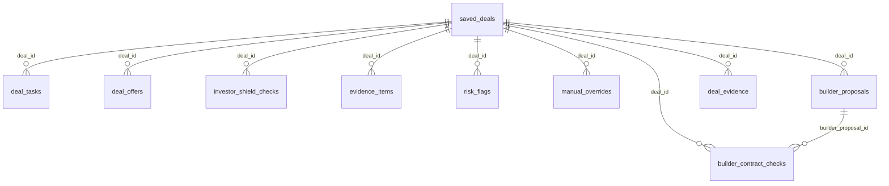

# Phase 4H-1B Current Database Schema

## Purpose

This document locks the current database schema scope for the Phase 4 handover before deeper environment, recovery, and operating documentation is written.

## Database Boundary

The current application database boundary is the schema-qualified PostgreSQL namespace `brik_by_brik_engine`, accessed through the shared adapter in `lib/db/postgres.ts`.

The adapter reads `DATABASE_URL` and creates one shared `pg.Pool` instance for all database traffic. If `DATABASE_URL` is absent, the adapter throws before any query is issued.

The repository also contains older Phase 4A migration files that define legacy, unqualified tables such as `deals`, `tasks`, and `offers`. Those files are historical migration evidence only and are not the table surface used by the current repository code paths documented below.

## Migration Inventory

| Migration | Purpose | Current Schema Surface | Notes |
|---|---|---|---|
| `db/migrations/20260521_phase4a_minimal_schema.sql` | Legacy Phase 4A minimal operator-command schema | Legacy unqualified tables | Historical baseline only; not the current repository read/write target. |
| `db/migrations/20260522_phase4a_saved_deals_table.sql` | Create `saved_deals` | `brik_by_brik_engine.saved_deals` | Core deal record table for the current app. |
| `db/migrations/20260522_phase4a_deal_tasks_table.sql` | Create `deal_tasks` | `brik_by_brik_engine.deal_tasks` | Task records linked to saved deals. |
| `db/migrations/20260522_phase4a_deal_offers_table.sql` | Create `deal_offers` | `brik_by_brik_engine.deal_offers` | Offer records linked to saved deals. |
| `db/migrations/20260524_phase4b_investor_shield_tables.sql` | Create Investor Shield tables | `brik_by_brik_engine.investor_shield_checks`, `evidence_items`, `risk_flags`, `manual_overrides`, `builder_proposals`, `builder_contract_checks` | Investor Shield read-model and control tables. |
| `db/migrations/20260622_phase4e_deal_evidence_table.sql` | Create Evidence Lite table | `brik_by_brik_engine.deal_evidence` | Canonical text-note evidence table used by Evidence Lite. |

## Table Inventory

| Table | Key Columns | Primary Use | Source Evidence |
|---|---|---|---|
| `brik_by_brik_engine.saved_deals` | `id`, `address`, `classification`, `governance_state`, `capital_protection_state`, `pipeline_state`, `engine_result_json`, `risk_summary_json`, `next_action` | Core saved deal record and canonical deal state | `db/migrations/20260522_phase4a_saved_deals_table.sql`, `lib/operator-command/saved-deals-repository.ts` |
| `brik_by_brik_engine.deal_tasks` | `id`, `deal_id`, `task_title`, `task_type`, `task_status`, `priority`, `due_date`, `blocker_reason`, `created_at`, `completed_at` | Deal task tracking | `db/migrations/20260522_phase4a_deal_tasks_table.sql`, `lib/operator-command/deal-tasks-repository.ts` |
| `brik_by_brik_engine.deal_offers` | `id`, `deal_id`, `offer_amount`, `offer_type`, `offer_status`, `offer_rationale`, `seller_response`, `created_at` | Offer tracking | `db/migrations/20260522_phase4a_deal_offers_table.sql`, `lib/operator-command/deal-offers-repository.ts` |
| `brik_by_brik_engine.investor_shield_checks` | `id`, `deal_id`, `gate_key`, `sub_gate_key`, `status`, `severity`, `confidence`, `required_evidence`, `summary`, `created_at`, `updated_at` | Investor Shield gate checks | `db/migrations/20260524_phase4b_investor_shield_tables.sql`, `lib/investor-shield/investor-shield-repository.ts` |
| `brik_by_brik_engine.evidence_items` | `id`, `deal_id`, `gate_key`, `sub_gate_key`, `evidence_type`, `source`, `label`, `notes`, `file_url`, `advisory_only`, `created_at` | Investor Shield evidence items | `db/migrations/20260524_phase4b_investor_shield_tables.sql`, `lib/investor-shield/investor-shield-repository.ts` |
| `brik_by_brik_engine.risk_flags` | `id`, `deal_id`, `gate_key`, `severity`, `message`, `source`, `created_at` | Investor Shield risk flags | `db/migrations/20260524_phase4b_investor_shield_tables.sql`, `lib/investor-shield/investor-shield-repository.ts` |
| `brik_by_brik_engine.manual_overrides` | `id`, `deal_id`, `gate_key`, `reason`, `approved_by`, `created_at` | Manual approval/override record | `db/migrations/20260524_phase4b_investor_shield_tables.sql`, `lib/investor-shield/investor-shield-repository.ts` |
| `brik_by_brik_engine.builder_proposals` | `id`, `deal_id`, `builder_name`, `quoted_amount`, `scope_summary`, `status`, `created_at` | Builder proposal records | `db/migrations/20260524_phase4b_investor_shield_tables.sql`, `lib/investor-shield/investor-shield-repository.ts` |
| `brik_by_brik_engine.builder_contract_checks` | `id`, `deal_id`, `builder_proposal_id`, `status`, `has_signed_contract`, `has_payment_schedule`, `has_scope_of_works`, `has_start_date`, `has_insurance_evidence`, `notes`, `created_at` | Builder contract completeness checks | `db/migrations/20260524_phase4b_investor_shield_tables.sql`, `lib/investor-shield/investor-shield-repository.ts` |
| `brik_by_brik_engine.deal_evidence` | `id`, `deal_id`, `evidence_type`, `linked_gate`, `title`, `note`, `status`, `reviewed`, `reviewer_note`, `created_at`, `updated_at` | Evidence Lite canonical text-note evidence | `db/migrations/20260622_phase4e_deal_evidence_table.sql`, `lib/evidence-lite/evidence-lite-repository.ts` |

## Relationship Diagram

## Data Ownership and Authority

The technical authority for the current schema is the application repository code that uses the shared Postgres adapter. The following code paths can read or write the documented tables:

- `lib/operator-command/saved-deals-repository.ts`
- `lib/operator-command/deal-tasks-repository.ts`
- `lib/operator-command/deal-offers-repository.ts`
- `lib/investor-shield/investor-shield-repository.ts`
- `lib/investor-shield/investor-shield-read-model.ts`
- `lib/investor-shield/load-investor-shield-ui-model.ts`
- `lib/evidence-lite/evidence-lite-repository.ts`
- `lib/pdf-evidence-pack/load-pdf-evidence-pack.ts`
- `lib/investor-review/load-investor-review-page-model.ts`

This document does not prove human ownership, DB-role assignment, or production write authority. It only proves repository-level intent and repository-level data access paths.

## Read and Write Paths

### Saved Deals

- Create: `createSavedDeal`
- Read: `getSavedDealById`, `listSavedDeals`
- Update: `updateSavedDeal`, `archiveSavedDeal`, `updateSavedDealPipelineState`
- Side effect: `createSavedDeal` attempts to create default Investor Shield checks after inserting the deal

### Deal Tasks

- Create: `createTask`
- Read: `listTasksForDeal`
- Update: `updateTaskStatus`, `markTaskBlocked`, `completeTask`

### Deal Offers

- Create: `createOffer`
- Read: `listOffersForDeal`
- Update: `updateOfferStatus`, `updateSellerResponse`

### Investor Shield

- Read model assembly: `loadInvestorShieldEvaluationInput`
- Evaluation: `loadAndEvaluateInvestorShield`
- UI model assembly: `loadInvestorShieldUiModelForDeal`
- Repository writes: `insertInvestorShieldChecks`, `insertEvidenceItem`, `insertRiskFlag`, `insertManualOverride`, `insertBuilderProposal`, `insertBuilderContractCheck`
- Repository reads: `listInvestorShieldChecksByDealId`, `listEvidenceItemsByDealId`, `listRiskFlagsByDealId`, `listManualOverridesByDealId`, `listBuilderProposalsByDealId`, `listBuilderContractChecksByDealId`

### Evidence Lite

- Create: `createEvidenceLite`
- Read: `listEvidenceLiteForDeal`, `getEvidenceLiteById`
- Update: `updateEvidenceLite`
- Mapping guardrails: canonical values are enforced in `mapEvidenceLiteRow`

### Downstream Read Surfaces

- Investor Review page loads the evidence pack for a saved deal and renders it read-only.
- PDF evidence pack composition reads saved deals, tasks, offers, Evidence Lite, and Investor Shield data.

## Constraints and Safety

- All database access goes through the shared adapter in `lib/db/postgres.ts`.
- `DATABASE_URL` must exist before any pool or query can be created.
- Repository code uses schema-qualified SQL for the current app surface.
- `saved_deals` inserts can trigger default Investor Shield check creation, but a failure in that side effect is logged and does not block the saved deal insert return value.
- Evidence Lite storage rejects legacy `SOLICITOR_FEEDBACK` and `GENERAL` values in code even if a bad row exists.
- The reviewed code paths are read-oriented for investor review and evidence-pack rendering; they do not imply production mutation authority beyond the explicit repository functions above.

## Production Schema Verification Boundary

Production verification evidence in the repository confirms the live deployment identity, the presence of `DATABASE_URL` in production, and safe read-route behavior. That evidence does not re-run DDL in this task and does not prove live table contents beyond the inspected read paths.

This boundary intentionally stops at documentation of schema structure and repository access patterns. It does not claim a successful production migration execution in this step.

## Backup and Recovery References

- `docs/phase4/PHASE_4E_P1A_PRODUCTION_BACKUP_AND_RECOVERY_READINESS_VERIFICATION.md`
- `docs/phase4/PHASE_4E_P0_PRODUCTION_ENVIRONMENT_AND_DEPLOYMENT_VERIFICATION.md`

Those documents are the repository evidence for provider identity, backup readiness, PITR status, and the current recovery limitations that belong in the later handover steps.

## Known Limitations

- The legacy Phase 4A migration file defines old unqualified tables that are not the current repository access surface.
- This document does not prove live row counts, current data quality, or full production schema drift.
- Human ownership, access control, and restore authority remain unverified in repository evidence.
- Recovery readiness is not established here; it is only referenced.
- This document does not verify whether every table contains the expected production data.

## Explicit Non-Implementation

This step does not:

- modify runtime code
- modify migrations
- modify production data
- update README files
- create a release tag
- begin Phase 5
- generate PDFs
- perform AI, OCR, uploads, scraping, automation, or CRM expansion
- claim ownership or permissions not proven by repository evidence
- claim production backup or restore capability beyond the referenced evidence

## Result

`PHASE 4H-1B DATABASE SCHEMA DOCUMENTATION COMPLETE ? READY FOR PHASE 4H-2 ENVIRONMENT, DEPLOYMENT, RECOVERY, AND OWNERSHIP DOCUMENTATION`
